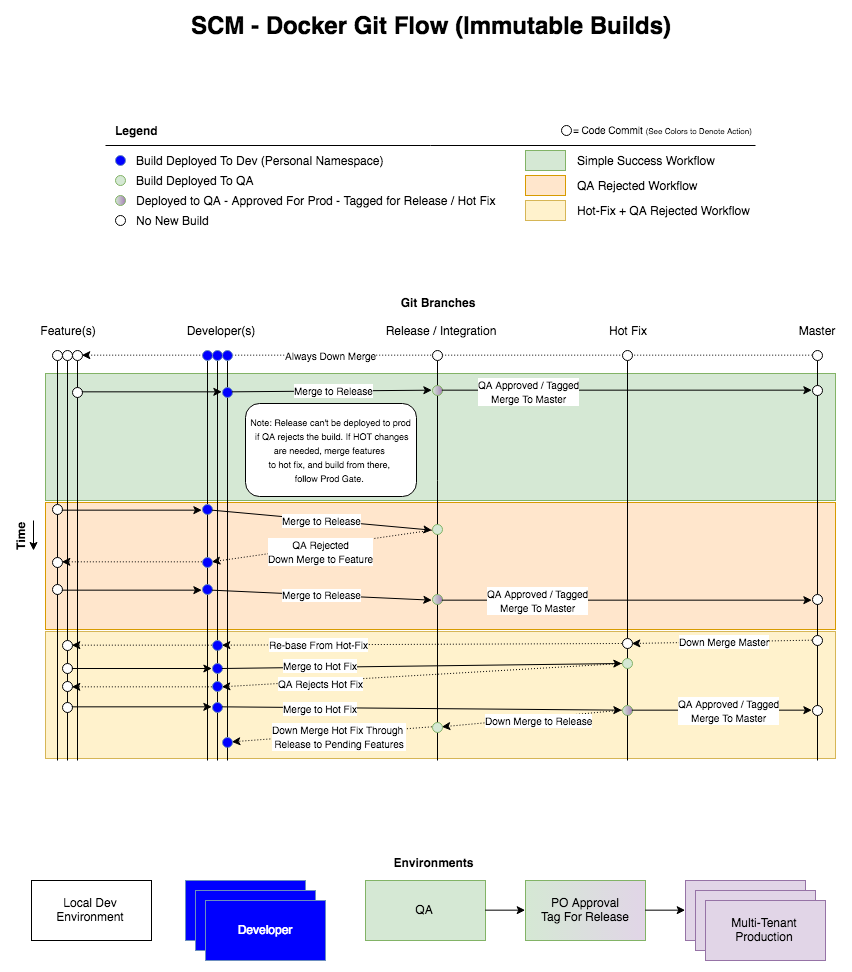

# Containers As Build Artifacts

The important thing to understand when building and deploying containers through a development cycle, is that you should be testing and approving the same built container as it progresses through the pipeline. It can certainly be re-tagged throughout the process, but you should avoid building at every stage of your approval/deployment pipeline.

